# KOROBOS -- Architecture Diagram

Version: 1.0 \
Owner: Saravana Perumal K \
Project: KOROBOS -- Second Brain Operating System

------------------------------------------------------------------------

# Architecture Overview

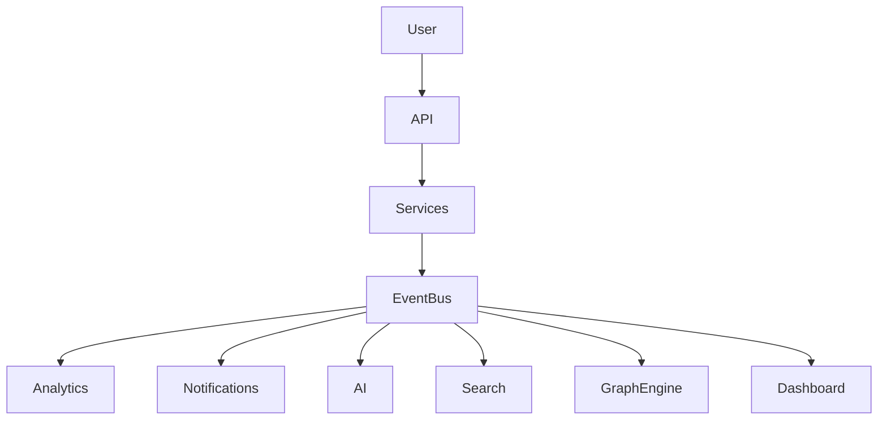

------------------------------------------------------------------------

# C4 Architecture diagrams

## System Context Diagram

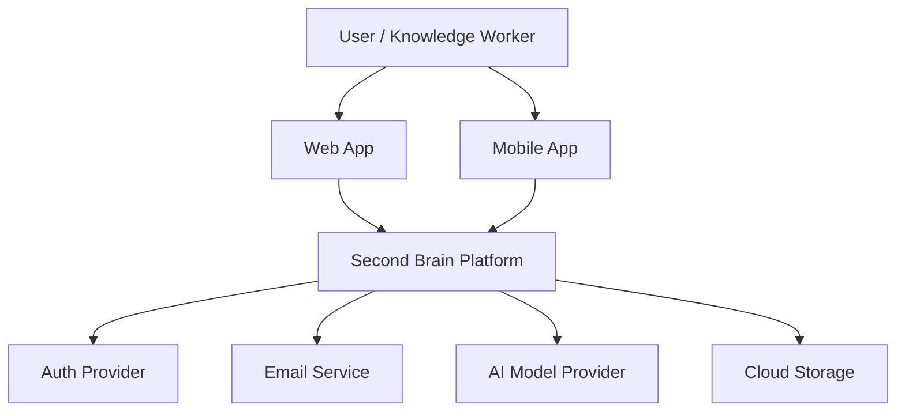

------------------------------------------------------------------------

## Container Diagram

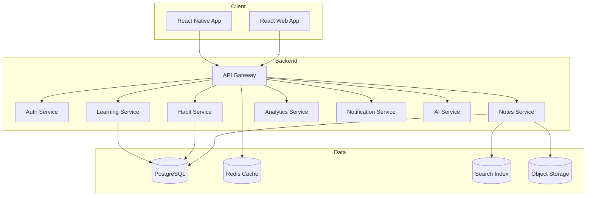

------------------------------------------------------------------------

## Component Diagram (Notes Service)

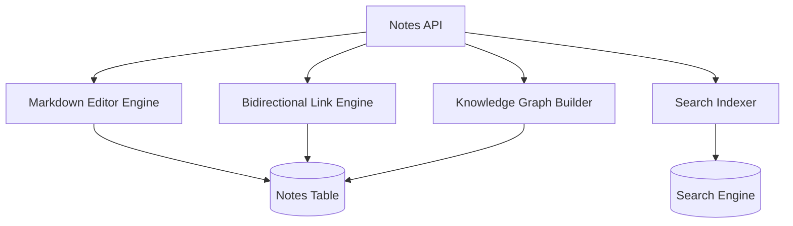

------------------------------------------------------------------------

# Complete Database ER Diagram

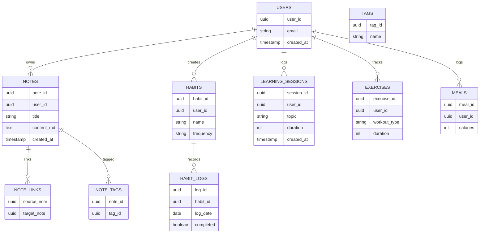

------------------------------------------------------------------------

# Microservice Architecture Map

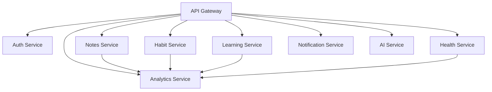

------------------------------------------------------------------------

# Realtime Collaboration Architecture

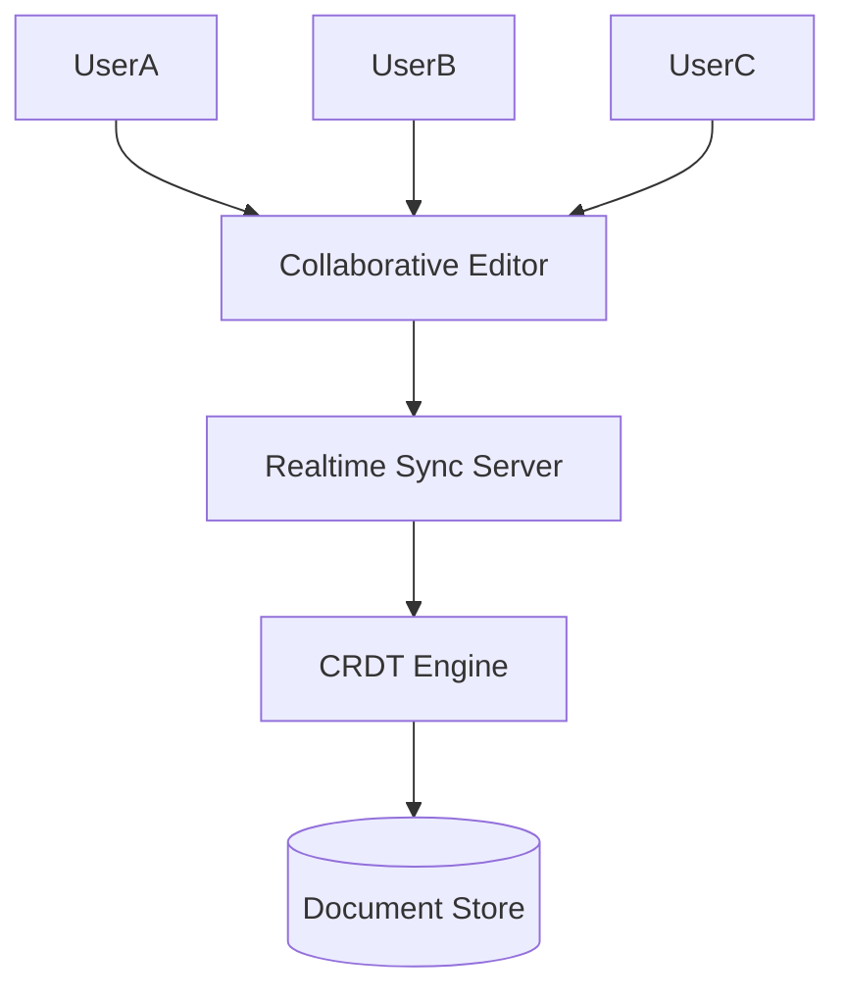

------------------------------------------------------------------------

# Event Flow Architecture

## Global Event Flow Architecture

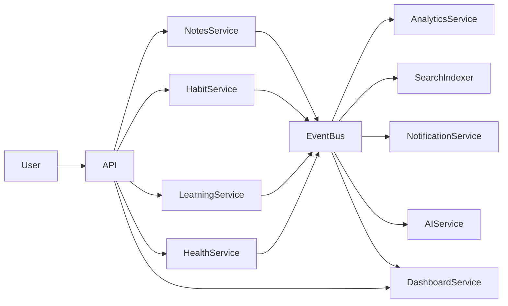

------------------------------------------------------------------------

## Knowledge Vault Event Flow

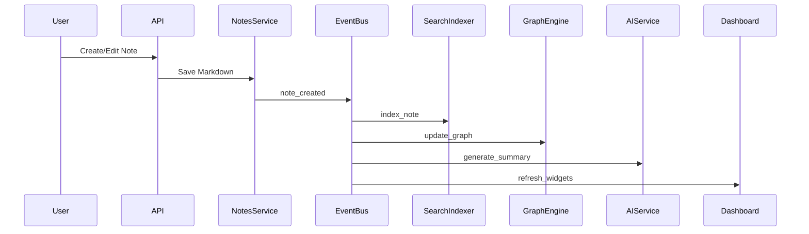

------------------------------------------------------------------------

## Note Linking Event Flow

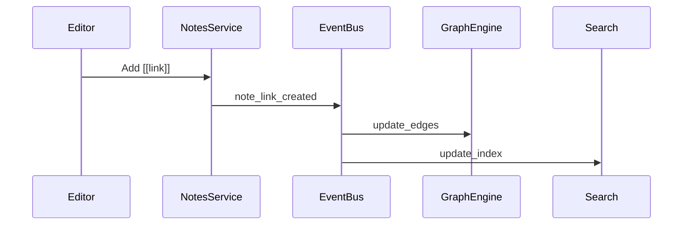

------------------------------------------------------------------------

## Habit Tracking Event Flow

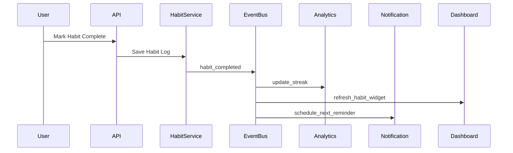

------------------------------------------------------------------------

## Learning Tracker Event Flow

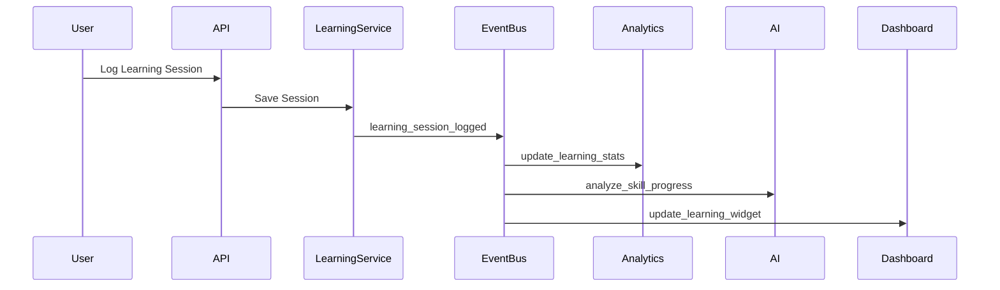

------------------------------------------------------------------------

## Health Tracking Event Flow

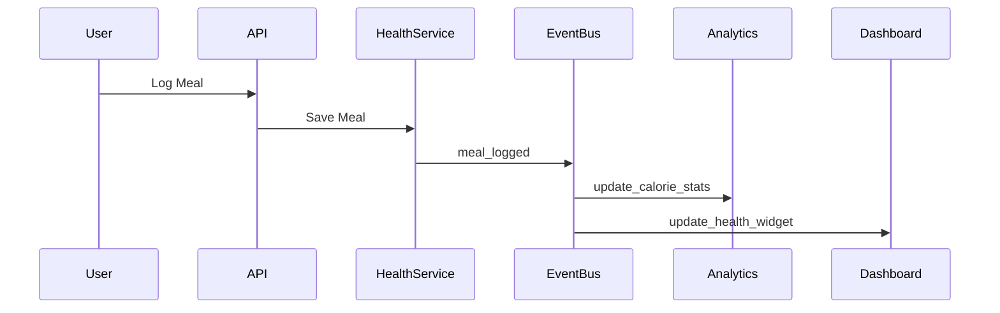

------------------------------------------------------------------------

## Exercise Tracking Event Flow

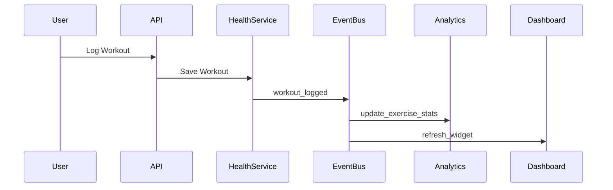

------------------------------------------------------------------------

## Dashboard Widget Update Flow

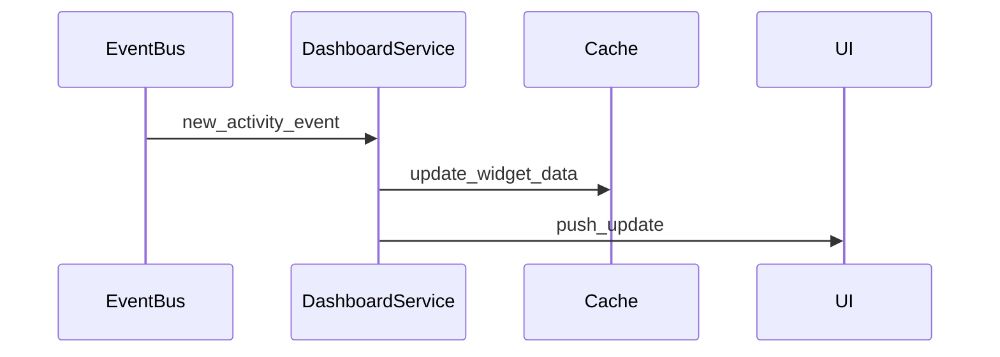

------------------------------------------------------------------------

## Notification Event Flow

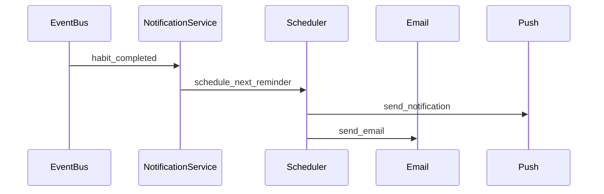

------------------------------------------------------------------------

## Analytics Engine Event Flow

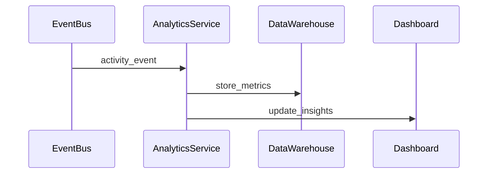

------------------------------------------------------------------------

## Search Indexing Pipeline

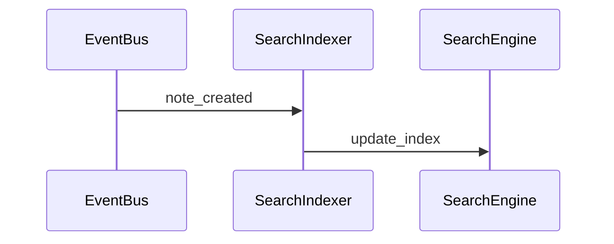

------------------------------------------------------------------------

## Knowledge Graph Update Flow

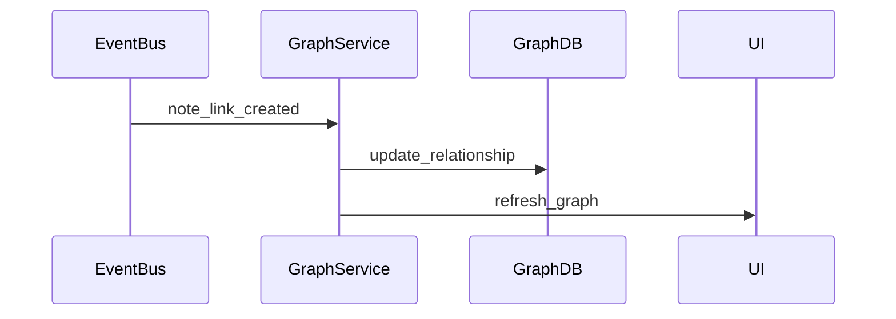

------------------------------------------------------------------------

## AI Insight Pipeline

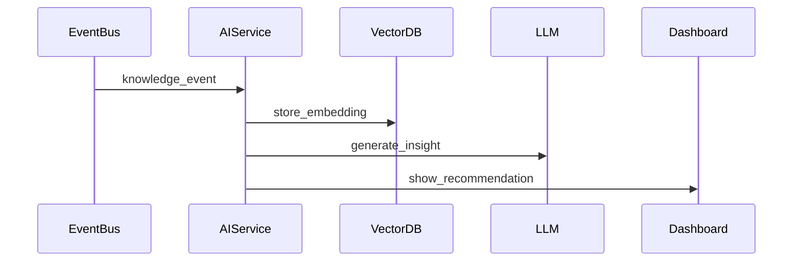

------------------------------------------------------------------------

## Daily Insight Generation Flow

```mermaid
sequenceDiagram

participant Scheduler
participant Analytics
participant AI
participant Dashboard

Scheduler->>Analytics: aggregate_daily_metrics
Analytics->>AI: send_behavior_data
AI->>Dashboard: generate_daily_insights
```

------------------------------------------------------------------------

# AI Pipeline Architecture

```mermaid
flowchart TB

UserInput[User Note / Data]

Preprocess[Text Preprocessing]

Embedding[Embedding Generator]

VectorDB[(Vector Database)]

Retriever[Semantic Retriever]

LLM[LLM Engine]

Insight[Insight Generator]

UserInput --> Preprocess
Preprocess --> Embedding
Embedding --> VectorDB

Retriever --> VectorDB
Retriever --> LLM

LLM --> Insight
Insight --> Dashboard
```
