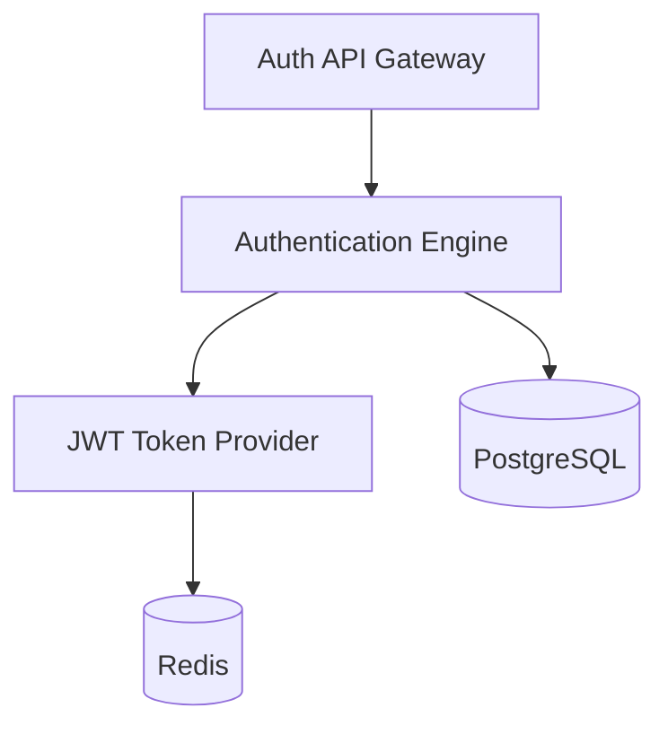

# KOROBOS – Enterprise LLD Template
Document Name: Auth Service Low Level Design
Project: KOROBOS – Second Brain Operating System
Version: 1.0
Author: Saravana Perumal K
Date: 2026-03-07
Status: Draft

## 1. Overview
### 1.1 Purpose
The Auth Service handles user authentication, registration, session management, and token issuance for the KOROBOS platform.

### 1.2 Scope
**In Scope**
* User Signup and Login.
* JWT Token generation and refresh.
* Session management.
**Out of Scope**
* Third-party OAuth integration (MVP).
* User profile image hosting.

### 1.3 Dependencies
| Dependency | Purpose |
| :--- | :--- |
| PostgreSQL | Data persistence for user credentials. |
| Redis | Session caching and token blacklisting. |

## 2. Architecture
### 2.1 Component Overview
Auth Controller → Authentication Engine → Token Provider → Repository Layer.

### 2.2 Component Diagram

## **3\. Data Model**

### **3.1 Tables**

**Users Table**  
| Column | Type | Description |  
| :--- | :--- | :--- |  
| user\_id | UUID | Unique identifier (PK) |  
| email | String | User email (Unique) |  
| password\_hash | String | Hashed password |  
| created\_at | Timestamp | Record creation time |

## **4\. API Design**

### **4.1 Signup**

POST /auth/signup

### **4.2 Login**

POST /auth/login

### **4.3 Refresh Token**

POST /auth/refresh

## **5\. Internal Logic**

### **5.1 Password Hashing**

* Uses industry-standard hashing (e.g., Argon2 or Bcrypt).

### **5.2 Token Generation**

* Issues short-lived Access Tokens (JWT) and long-lived Refresh Tokens.

## **6\. Security Design**

* **JWT Authentication**: Uses RS256 or HS256 algorithms.  
* **Input Validation**: Sanitizes all user inputs to prevent injection.
