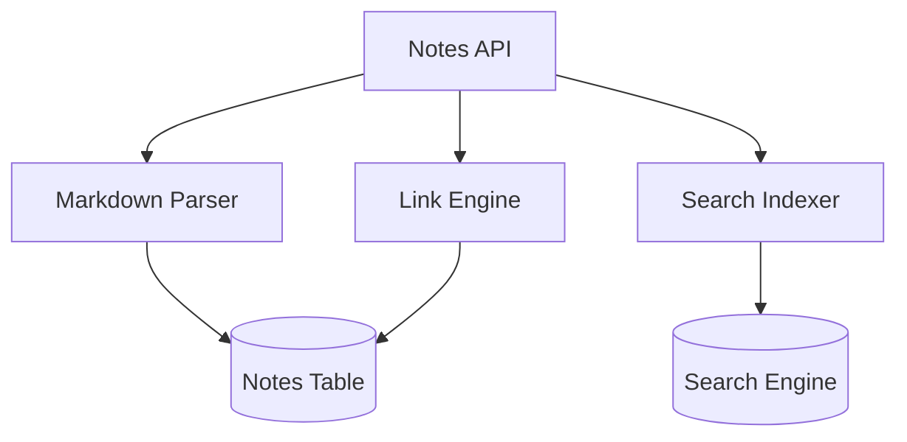

# CortexOS – Enterprise LLD Template
Document Name: Notes Service Low Level Design
Project: CortexOS – Second Brain Operating System
Version: 1.0
Author: Saravana Perumal K
Date: 2026-03-07
Status: Draft

## 1. Overview
### 1.1 Purpose
The Notes Service manages markdown-based notes, bidirectional linking, and organizes content for the Knowledge Vault.

### 1.2 Scope
**In Scope**
* Markdown note creation, editing, and deletion.
* Note linking and backlink tracking.
* Tag management and search indexing.
**Out of Scope**
* Real-time collaborative editing (handled by Collaboration Service).

### 1.3 Dependencies
| Dependency | Purpose |
| :--- | :--- |
| PostgreSQL | Storage for notes and link relationships. |
| Search Engine | Full-text search indexing (Meilisearch/Elasticsearch). |
| EventBus | Publishing note creation/edit events. |

## 2. Architecture
### 2.1 Component Overview
Notes API → Markdown Parser → Link Engine → Search Indexer.

### 2.2 Component Diagram

## **3\. Data Model**

### **3.1 Tables**

**Notes Table**  
| Column | Type | Description |  
| :--- | :--- | :--- |  
| note\_id | UUID | Unique ID (PK) |  
| user\_id | UUID | Owner ID (FK) |  
| title | Text | Note title |  
| content\_md | Text | Markdown content |  
**Note Links**  
| Column | Type | Description |  
| :--- | :--- | :--- |  
| source\_note\_id | UUID | The note containing the link |  
| target\_note\_id | UUID | The note being linked to |

## **4\. API Design**

### **4.1 Create Note**

POST /api/v1/notes

### **4.2 Get Note**

GET /api/v1/notes/{id}

## **5\. Internal Logic**

### **5.1 Link Detection Algorithm**

* Pattern: r"\\\[\\\[(.\*?)\\\]\\\]".  
* Extracts titles within double brackets to create relationships in the note\_links table.

## **6\. Event Architecture**

### **6.1 Events Published**

| Event | Description |
| :---- | :---- |
| note.created | Triggered on new note creation. |
| note\_link\_created | Triggered when a new \[\[link\]\] is detected. |
