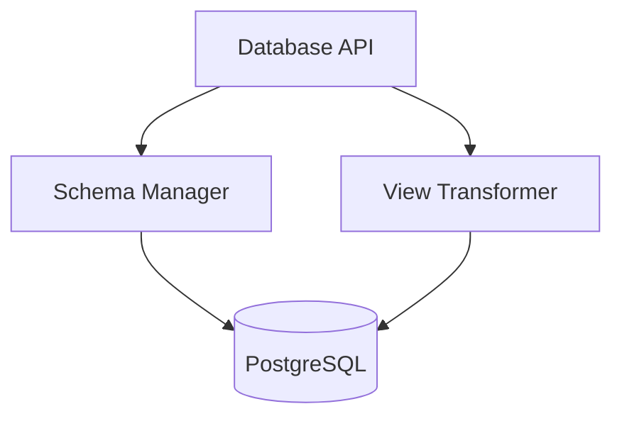

# CortexOS – Enterprise LLD Template
Document Name: Database Service Low Level Design
Project: CortexOS – Second Brain Operating System
Version: 1.0
Author: Saravana Perumal K
Date: 2026-03-07
Status: Draft

## 1. Overview
### 1.1 Purpose
The Database Service manages structured data systems (Notion-style), providing flexible data organization through dynamic tables and multiple views.

### 1.2 Scope
**In Scope**
* Management of structured databases (Habit, Learning, Projects).
* Support for multiple views: Table, Kanban, Calendar, Timeline, and Gallery.
* Field type management (text, date, status, frequency).
**Out of Scope**
* Relational joins between independent user-defined databases.

### 1.3 Dependencies
| Dependency | Purpose |
| :--- | :--- |
| PostgreSQL | Primary persistence for structured records. |
| Redis | Caching for database view configurations. |

## 2. Architecture
### 2.1 Component Overview
Database API → View Transformer → Schema Manager → Record Repository.

### 2.2 Component Diagram

## **3\. Data Model**

### **3.1 Tables**

**Databases Table**  
| Column | Type | Description |  
| :--- | :--- | :--- |  
| db\_id | UUID | Unique ID |  
| user\_id | UUID | Owner |  
| type | String | Habit, Learning, or Project |  
**Database\_Records Table**  
| Column | Type | Description |  
| :--- | :--- | :--- |  
| record\_id | UUID | PK |  
| db\_id | UUID | FK to Databases |  
| data | JSONB | Dynamic field values |

## **4\. API Design**

### **4.1 Create Database**

POST /api/v1/databases

### **4.2 Get View**

GET /api/v1/databases/{id}/view?type=kanban

## **5\. Internal Logic**

### **5.1 View Transformation**

* Logic maps JSONB data to specific frontend layouts (e.g., grouping by "status" for Kanban).

## **6\. Security Design**

* **RBAC**: Access controlled via user\_id ownership checks.