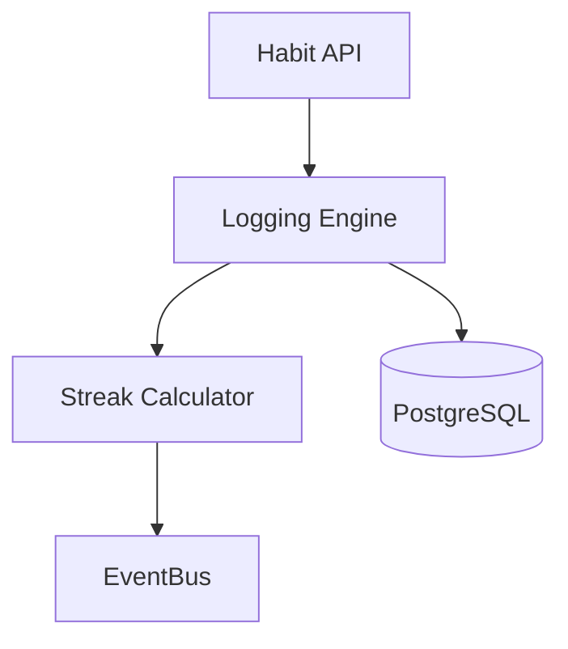

# CortexOS – Enterprise LLD Template
Document Name: Habit Service Low Level Design
Project: CortexOS – Second Brain Operating System
Version: 1.0
Author: Saravana Perumal K
Date: 2026-03-07
Status: Draft

## 1. Overview
### 1.1 Purpose
The Habit Service manages daily habit tracking, streak calculations, and completion analytics.

### 1.2 Scope
**In Scope**
* Creating and managing habit definitions.
* Logging daily habit completions.
* Calculating streaks and consistency scores.

### 1.3 Dependencies
| Dependency | Purpose |
| :--- | :--- |
| PostgreSQL | Persistence for habit definitions and logs. |
| EventBus | Publishing habit completion events for analytics. |

## 2. Architecture
### 2.1 Component Overview
Habit API → Logging Engine → Streak Calculator → Event Publisher.

### 2.2 Component Diagram

## **3\. Data Model**

### **3.1 Tables**

**Habits Table**  
| Column | Type | Description |  
| :--- | :--- | :--- |  
| habit\_id | UUID | Unique ID (PK) |  
| user\_id | UUID | Owner ID |  
| habit\_name | String | Name of the habit |  
| frequency | String | Daily/Weekly/Monthly |  
**Habit Logs**  
| Column | Type | Description |  
| :--- | :--- | :--- |  
| log\_id | UUID | PK |  
| habit\_id | UUID | FK |  
| log\_date | Date | Date of entry |  
| completed | Boolean | Status |

## **4\. API Design**

### **4.1 Mark Habit Complete**

POST /habits/{id}/complete

### **4.2 Get Analytics**

GET /habits/analytics

## **5\. Event Architecture**

### **5.1 Events Published**

| Event | Description |
| :---- | :---- |
| habit.completed | Triggered when a habit is logged as complete. |