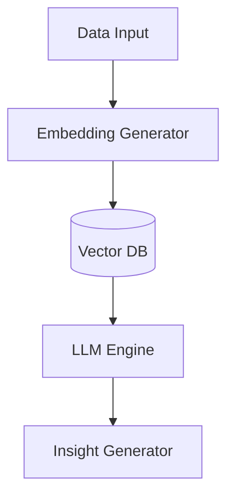

# KOROBOS – Enterprise LLD Template
Document Name: AI Service Low Level Design
Project: KOROBOS – Second Brain Operating System
Version: 1.0
Author: Saravana Perumal K
Date: 2026-03-07
Status: Draft

## 1. Overview
### 1.1 Purpose
The AI Service provides intelligent insights, automated summaries, and skill progress analysis by processing user notes and tracking data.

### 1.2 Scope
**In Scope**
* Generating note summaries.
* Analyzing skill progress from learning logs.
* Providing behavioral recommendations based on analytics.

### 1.3 Dependencies
| Dependency | Purpose |
| :--- | :--- |
| LLM Provider | External AI model (e.g., OpenAI/Gemini). |
| Vector DB | Storing note embeddings for semantic search. |

## 2. Architecture
### 2.1 Component Overview
Input Processor → Embedding Generator → LLM Engine → Insight Generator.

### 2.2 Component Diagram

## **3\. Internal Logic**

### **3.1 AI Insight Pipeline**

1. Receive knowledge or tracking event from EventBus.  
2. Generate vector embedding for the content.  
3. Query LLM with context for insight generation.

## **4\. API Design**

### **4.1 Get Daily Insights**

GET /dashboard/daily-insights (Internal fetch from Dashboard Service).