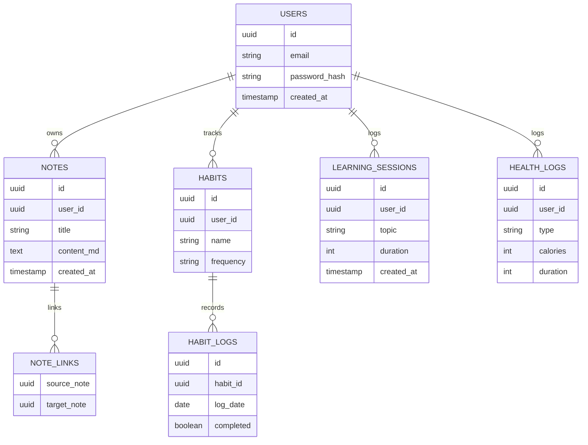
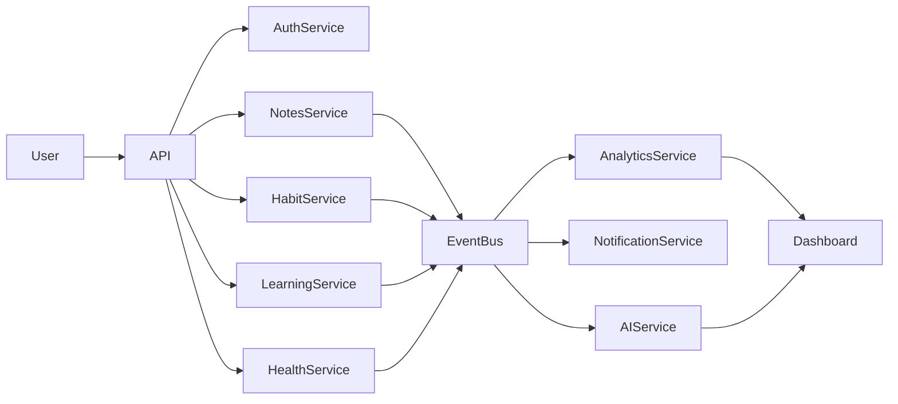
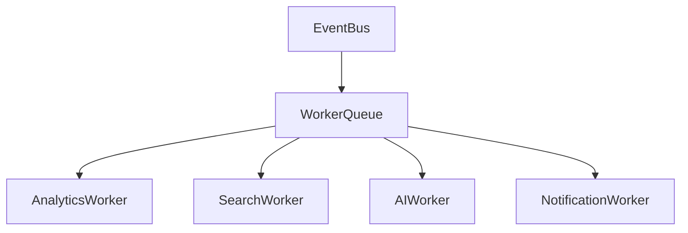
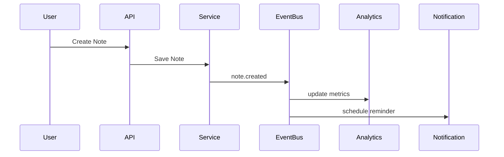
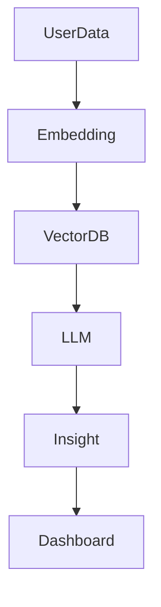

# KOROBOS Backend Detailed Design

Version: 1.0 \
Owner: Saravana Perumal K

---

# 1. System Overview

KOROBOS backend is a **microservice-based, event-driven system**
designed to power a Second Brain productivity platform.

Core capabilities:

- Knowledge management
- Habit tracking
- Learning analytics
- Health tracking
- AI insights
- Productivity analytics

Architecture pattern:

Client → API Gateway → Microservices → Event Bus → Analytics / AI /
Notifications → Databases

---

# 2. Core Microservices

- Auth Service
- Notes Service
- Habit Service
- Learning Service
- Health Service
- Analytics Service
- Notification Service
- AI Service

---

# 3. Entity Relationship Diagram (ERD)



---

# 4. System Data Flow (FD)



---

# 5. API Request / Response Schemas

## Create Note

POST /api/v1/notes

Request

```json
{
  "title": "Machine Learning",
  "content_md": "Introduction to ML"
}
```

Response

```json
{
  "id": "note_uuid",
  "title": "Machine Learning",
  "created_at": "2026-01-01T10:00:00"
}
```

---

## Mark Habit Complete

POST /api/v1/habits/{id}/complete

Response

```json
{
  "habit_id": "uuid",
  "completed": true,
  "streak": 14
}
```

---

## Log Learning Session

POST /api/v1/learning-session

Request

```json
{
  "topic": "AI",
  "duration": 120
}
```

---

# 6. Database Table Schemas

## Users

Column Type

---

id UUID
email TEXT
password_hash TEXT
created_at TIMESTAMP

---

## Notes

Column Type

---

id UUID
user_id UUID
title TEXT
content_md TEXT
created_at TIMESTAMP

---

## Habits

Column Type

---

id UUID
user_id UUID
name TEXT
frequency TEXT

---

## Habit Logs

Column Type

---

id UUID
habit_id UUID
log_date DATE
completed BOOLEAN

---

## Learning Sessions

Column Type

---

id UUID
user_id UUID
topic TEXT
duration INTEGER
created_at TIMESTAMP

---

# 7. Service Layer Logic

Example: Notes Service

    Create Note Flow

    1. Receive API request
    2. Validate request
    3. Store note in database
    4. Detect note links
    5. Publish event note.created
    6. Return response

Example: Habit Completion

    1. Receive completion request
    2. Store habit log
    3. Update streak
    4. Emit habit.completed event
    5. Update analytics

---

# 8. Background Workers

Background workers process asynchronous tasks.

Worker responsibilities:

- analytics aggregation
- search indexing
- AI insight generation
- notification scheduling

Example Worker Flow



Example technologies:

- Celery
- Redis Queue
- Temporal

---

# 9. Event Topics

Event topics used for inter-service communication.

Event Trigger

---

note.created note saved
note.link.created note linking
habit.completed habit finished
learning.session.logged learning session
meal.logged food logged
workout.logged workout logged

---

# 10. Event Processing Flow



---

# 11. Background AI Pipeline



Capabilities

- note summarization
- productivity insights
- study recommendations

---

# 12. Notification Worker

Workflow

    1. Receive event from bus
    2. Determine notification type
    3. Schedule reminder
    4. Send push/email

---

# 13. Example Microservice Folder Structure

    notes-service/

    app/
      main.py

    api/
      notes_routes.py

    services/
      notes_service.py

    repositories/
      notes_repository.py

    models/
      note_model.py

    schemas/
      note_schema.py

    workers/
      indexing_worker.py

---

# 14. Scalability Strategy

- horizontal microservice scaling
- Redis caching
- async event processing
- read replicas

Target capacity

100k concurrent users

---

# 15. Observability

Monitoring

- Prometheus
- Grafana

Tracing

- OpenTelemetry
- Jaeger

Logging

- ELK Stack

---

# Final Architecture Vision

KOROBOS backend acts as a **distributed intelligence engine**.

Key characteristics

- microservice architecture
- event-driven communication
- AI-powered insights
- scalable cloud infrastructure

The system enables KOROBOS to function as a **Second Brain Operating
System**.
