# **CortexOS**

# **UX Flow Diagrams**

**Version: 1.0**  
**Owner: Saravana Perumal K**

---

# **1\. UX Flow Overview**

**UX Flows define the step-by-step interaction between the user and CortexOS.**

**Primary flows:**

**1️⃣ User Onboarding Flow**  
**2️⃣ Login Flow**  
**3️⃣ Dashboard Interaction Flow**  
**4️⃣ Note Creation Flow**  
**5️⃣ Knowledge Linking Flow**  
**6️⃣ Habit Tracking Flow**  
**7️⃣ Learning Tracking Flow**  
**8️⃣ Health Tracking Flow**  
**9️⃣ Analytics Insight Flow**  
**🔟 AI Insight Flow**

---

# **2\. User Onboarding Flow**

### **Goal**

**Allow new users to quickly understand CortexOS and start using it.**

---

## **Flow Diagram**

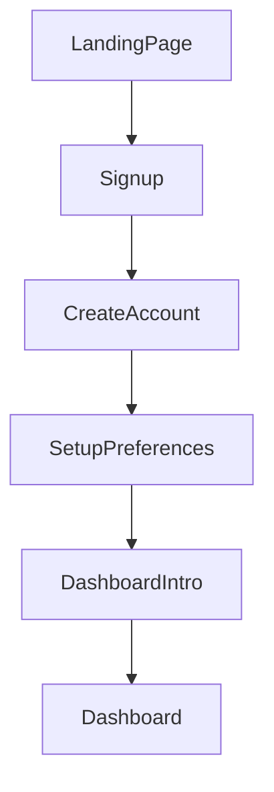

---

## **Step Breakdown**

| Step | Description |
| ----- | ----- |
| **Landing Page** | **User visits product website** |
| **Signup** | **User creates account** |
| **Preferences** | **User configures dashboard widgets** |
| **Intro** | **Product walkthrough** |
| **Dashboard** | **First interaction with system** |

---

# **3\. Login Flow**

### **Goal**

**Authenticate user and load personalized dashboard.**

---

## **Flow Diagram**

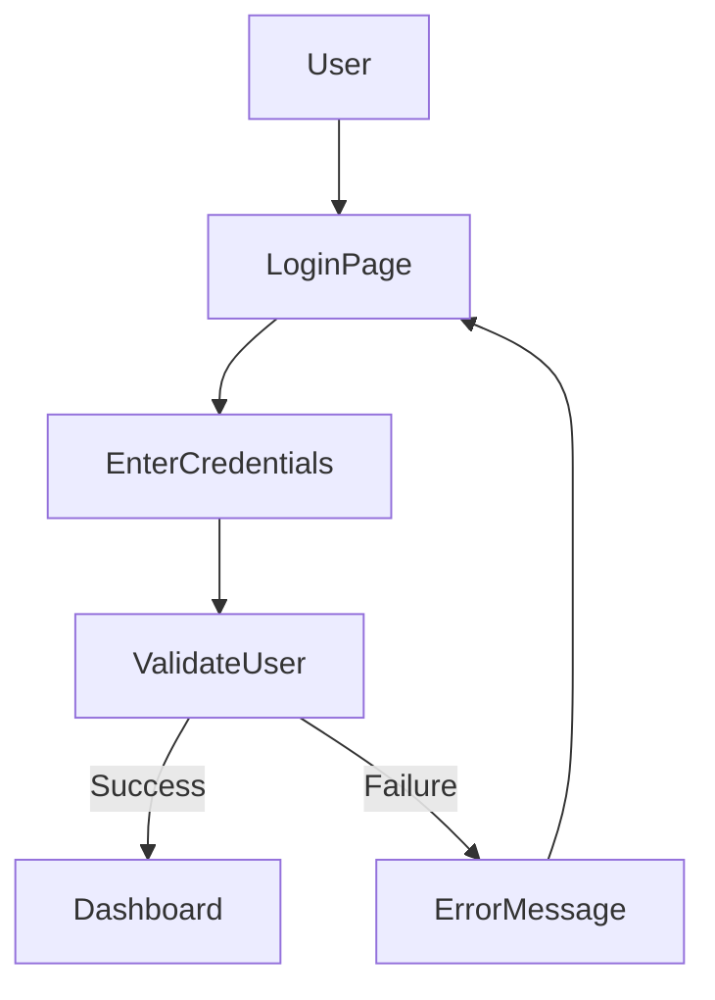

---

## **Backend Interaction**

**User authentication handled by Auth Service using OAuth2 \+ JWT.**

---

# **4\. Dashboard Interaction Flow**

### **Goal**

**Allow user to review productivity insights.**

---

## **Flow Diagram**

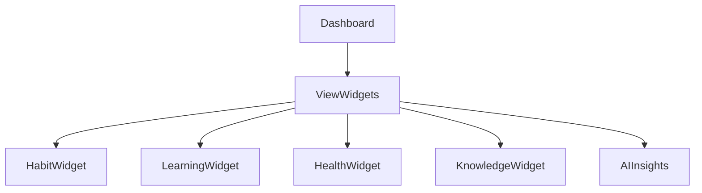

---

## **Interaction**

**User can:**

**• open widgets**  
**• mark habit complete**  
**• navigate to detailed pages**

---

# **5\. Note Creation Flow**

### **Goal**

**Capture knowledge quickly.**

---

## **Flow Diagram**

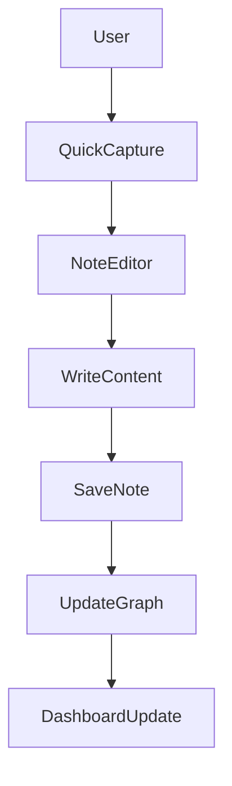

---

## **Backend Events**

**When note is saved:**

**Event generated**

       note_created

**Event bus triggers:**

**• search indexing**  
**• graph updates**  
**• AI insights**

**This matches the event architecture described in the system design.**

---

# **6\. Knowledge Linking Flow**

### **Goal**

**Connect related notes.**

---

## **Flow Diagram**

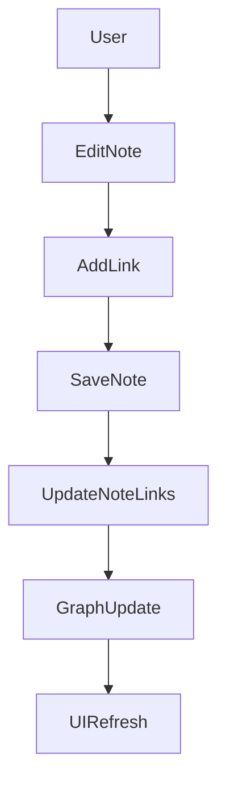

---

## **Example**

**User types**

       [[Machine Learning]]

**System automatically creates a relationship.**

---

# **7\. Habit Tracking Flow**

### **Goal**

**Track daily habits.**

---

## **Flow Diagram**

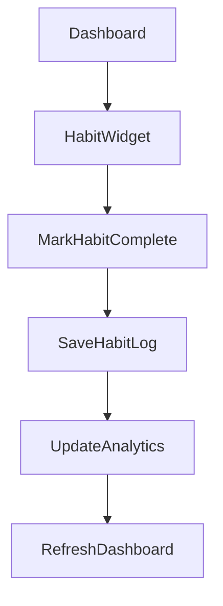

---

## **Backend Event**

       habit_completed

**Triggers**

**• analytics update**  
**• notification scheduling**  
**• widget refresh**

---

# **8\. Learning Tracking Flow**

### **Goal**

**Track study sessions.**

---

## **Flow Diagram**

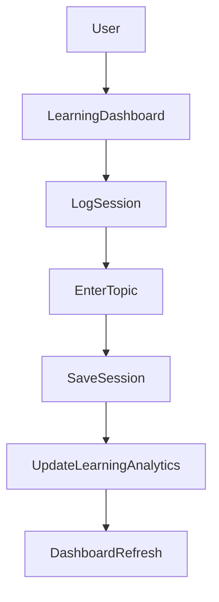

---

## **Analytics**

**System updates:**

 - **weekly learning hours**  
 - **topic progress**

---

# **9\. Health Tracking Flow**

### **Goal**

**Track fitness and nutrition.**

---

## **Food Logging Flow**

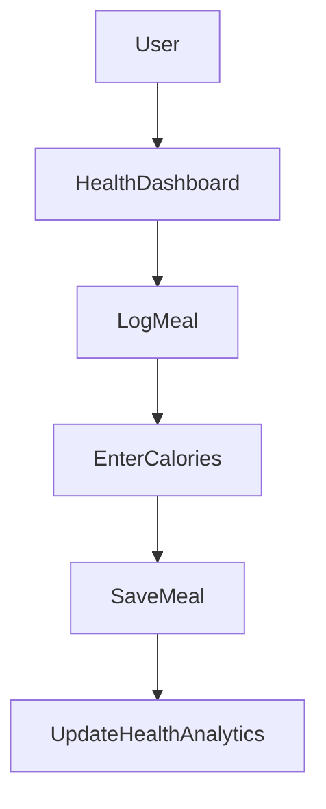

---

## **Workout Logging Flow**

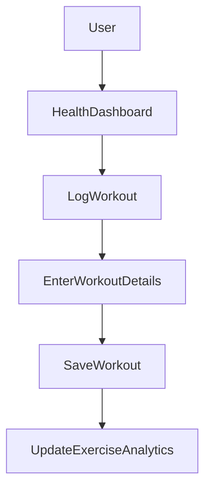

---

# **10\. Analytics Insight Flow**

### **Goal**

**Provide insights from activity data.**

---

## **Flow Diagram**

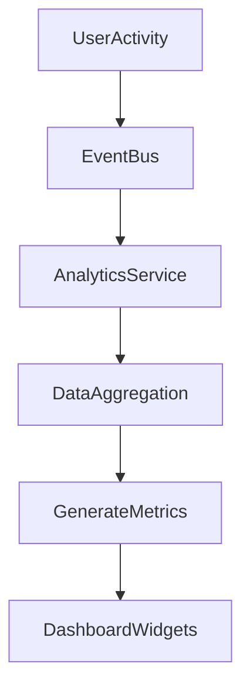

---

## **Example Metrics**

**• productivity score**  
**• habit consistency**  
**• learning growth**

---

# **11\. AI Insight Flow**

### **Goal**

**Generate intelligent recommendations.**

---

## **Flow Diagram**

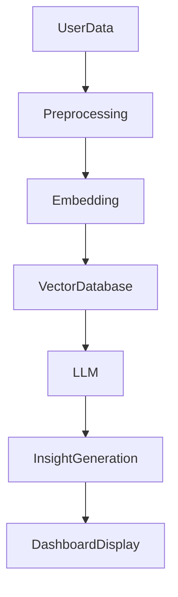

---

## **Example Insights**

**AI may suggest:**

 - **study topics**  
 - **productivity improvements**  
 - **habit adjustments**

**This aligns with the AI pipeline architecture in CortexOS.**

---

# **12\. Global Search Flow**

### **Goal**

**Allow users to find content across the system.**

---

## **Flow Diagram**

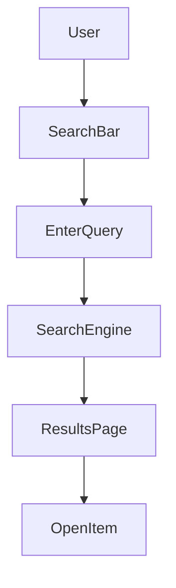

---

# **13\. Notification Flow**

### **Goal**

**Remind users to maintain habits.**

---

## **Flow Diagram**

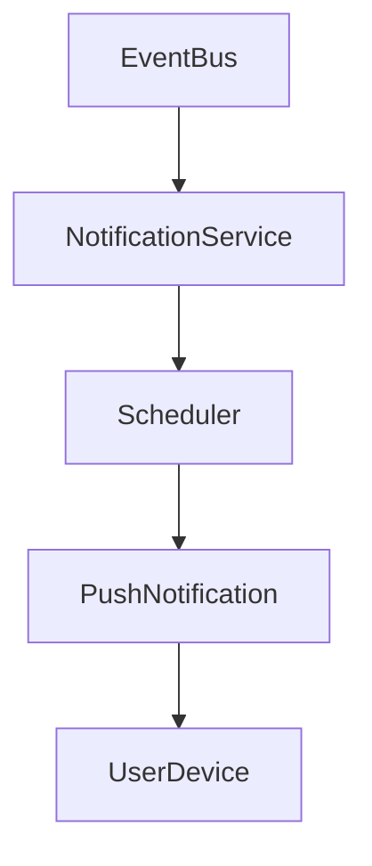

---

# **14\. Error Handling Flow**

### **Goal**

**Handle system failures gracefully.**

---

## **Flow Diagram**

```meramid
flowchart TD

UserAction --> APIRequest
APIRequest --> APIResponse

APIResponse -->|Success| UIUpdate
APIResponse -->|Failure| ErrorMessage
ErrorMessage --> Retry
```

---

# **15\. Cross Module Interaction Flow**

**CortexOS modules are interconnected.**

---

## **Example Flow**

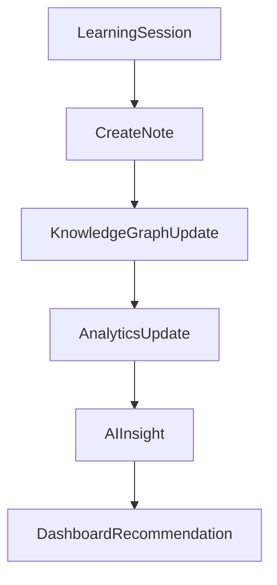

---

# **16\. Complete System UX Flow**

**This represents the full interaction ecosystem.**

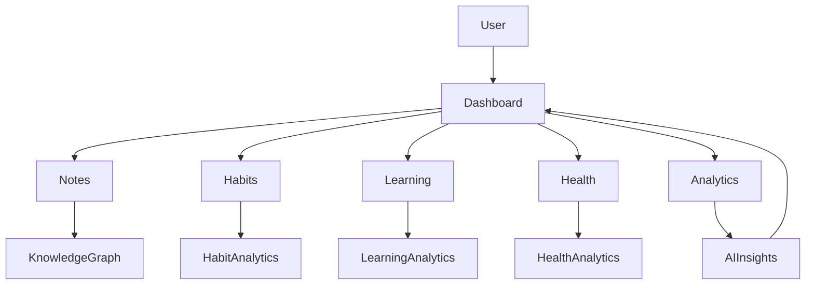

---

# **Final UX Flow Summary**

**CortexOS user flows revolve around five core loops:**

       Capture Knowledge
              ↓
       Track Activities
              ↓
       Generate Analytics
              ↓
       AI Insights
              ↓
       Continuous Improvement

**This creates a self-improving productivity ecosystem consistent with the Second Brain concept.**

